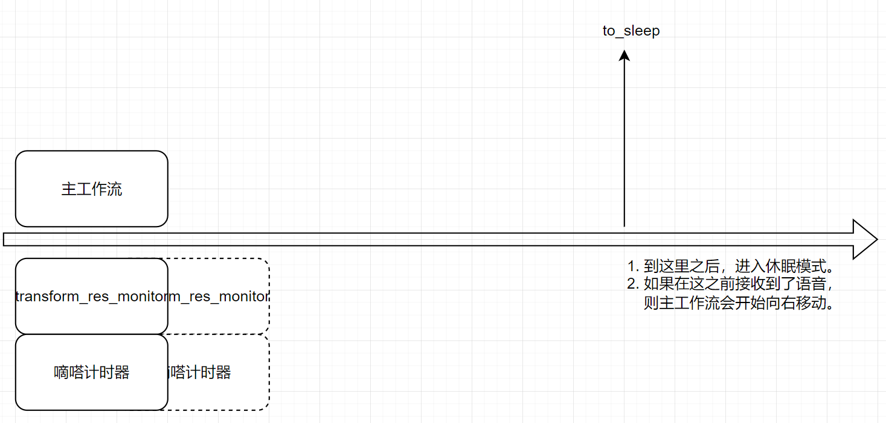

# 固定回复组件
这是一个使用检索小模型来检索话术库，对用户的query进行回答的组件。

这个组件能够像小爱同学那样，实时唤醒，自动休眠。

# 如何使用
首先，你需要在`src/config.json`文件里填写如下信息：
```json
{
    "lingji_key": "sk-xxx",            // 阿里云的灵积语音服务的api key                             
    "embedding_model_url": "xxx",      // embedding 模型的url，这里需要是使用Ollama部署的模型
    "name_embedding_model": "xxx",     // embedding 模型的名称
    "zijie_tts_app_id": "xxx",         // 字节跳动的火山引擎的语音合成服务的app id
    "zijie_tts_access_token": "xxx"    // 字节跳动的火山引擎的语音合成服务的access token
}
```
然后，你还需要把你的话术粘贴到`src/responses.txt`文件里，以下是示例：
```text
你好，我是小助手，请问有什么可以帮到你的？

你好，请问有什么可以帮到你的？

嗯，请问有什么可以帮到你的？
我会尝试为你找到答案。
```
在上面的话术库里，每一个话术是空了一行的，而第三个话术则是两行一起的，这种情况下，这连着的两行会被视为一个话术。

最后，你需要使用python 3.11 来安装依赖，并运行服务：
```bash
pip install -r requirements.txt
python src/main.py
```

# 原理介绍
这里主要介绍本组件的工作原理。

我们会使用“主工作流”、“transform_res_monitor”和“嘀嗒计时器”三个模块来描述本组件的工作原理。
- 主工作流：固定回复语音对话的核心程序。
- transform_res_monitor: 用于监测是否有语音输入。
- 嘀嗒计时器：用于计数。

我们将使用时间轴的方式来描述上述三个模块的运行顺序，以此来解释本组件的工作原理。


上图表示开始语音对话后，如何从激活态转换到激活态或休眠态的过程：

图中三个方框会从左到右移动，表示程序的运行。

- 步骤1：我们首先创建"transform_res_monitor"、"嘀嗒计时器"和"主工作流"，此时，“主工作流”会等待语音输入，而其他两个模块则会向右移动。
- 步骤2：如果"transform_res_monitor" 和 "嘀嗒计时器"运行到了“to_sleep"时间点，那么把这三个方框都kill掉，进入休眠模式。
- 步骤3：如果"transform_res_monitor" 和 "嘀嗒计时器"在前往"to_sleep"时间点的过程中，"transform_res_monitor"检测到了语音输入，那么把"transform_res_monitor"和"嘀嗒计时器“删除，同时”主工作流“会自动移动，然后回到步骤1。